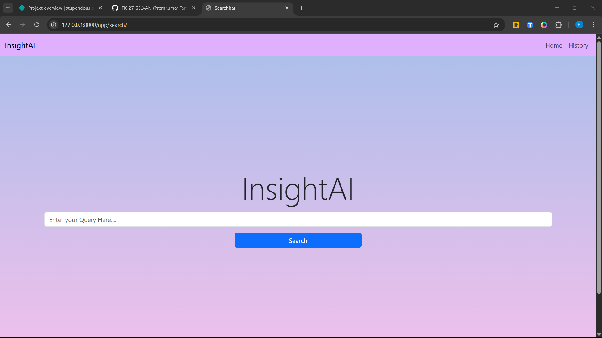
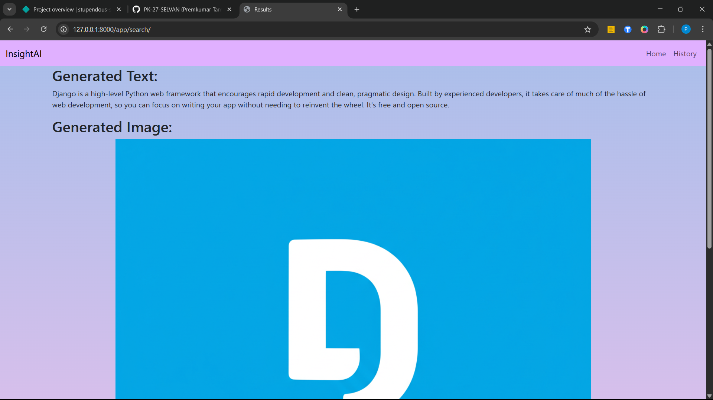
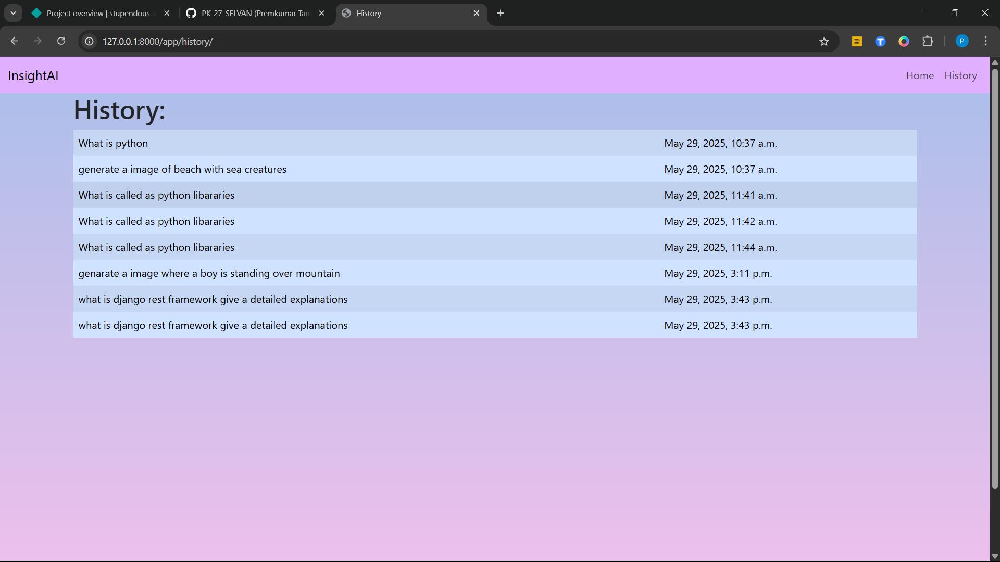

# Gemini-AI-Content-Generator
A Django-based platform for generating AI-powered text and images using Gemini

# Description
This project is a Django-based web application that leverages Gemini AI to generate both textual and visual content automatically. Designed for users who need fast, high-quality content creation, the platform integrates Gemini's multimodal capabilities to produce engaging written content and corresponding AI-generated images based on user prompts.The system offers a user-friendly interface for entering content prompts, managing generated outputs, and downloading or reusing content. This tool is ideal for content creators, marketers, bloggers, and educators seeking an efficient way to produce original content with minimal effort.

# Technologies used
- Django
- HTML
- CSS
- Bootstrap
- Javascript
- Gemini AI

# Key Feautres
- Text and image generation using Gemini AI
- Prompt-based content generation workflow
- Clean and responsive UI built with Django templating

# Screenshots

